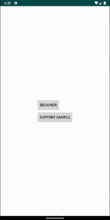

<h1 align="center">Corner Sheet</h1>
<p align="center">Behavior to make a view expands from corner</p>
<p align="center"><a href="https://github.com/heyalex/CornerSheet" target="_blank"></a></p>

## Usage

The usage is similar to [BottomSheetBehavior](https://developer.android.com/reference/com/google/android/material/bottomsheet/BottomSheetBehavior)

A simple view with behavior in xml will be look like:

```xml
<androidx.coordinatorlayout.widget.CoordinatorLayout
    android:id="@+id/coordinator"
    android:layout_width="match_parent"
    android:layout_height="match_parent">

        <FrameLayout
            android:id="@+id/corner_behavior_container"
            android:layout_width="match_parent"
            android:layout_height="match_parent"
            app:backgroundTint="@color/colorPrimary"
            app:behavior_expanded_width="175dp"
            app:behavior_horizontal_peekHeight="94dp"
            app:behavior_peekHeight="60dp"
            app:layout_behavior="com.github.heyalex.cornersheet.behavior.CornerSheetBehavior"
            app:shapeAppearanceOverlay="@style/ShapeAppearanceOverlay.CornerShape"
            tools:ignore="MissingPrefix">

            <androidx.appcompat.widget.Toolbar
                android:layout_width="match_parent"
                android:layout_height="wrap_content"
                android:background="@android:color/transparent"
                app:title="Corner Sample"
                app:titleTextColor="@android:color/white" />

        </FrameLayout>

</androidx.coordinatorlayout.widget.CoordinatorLayout>

```

You can use the following attributes on view with CornerSheetBehavior.

| Properties                                 | Type                  | Default |
| ------------------------                   | --------------------- | ------- |
| `behavior_horizontalExpandingRatio`        | float                 | 0.2f    |
| `behavior_expanded_width`                  | dimension             | 0dp     |
| `behavior_horizontal_peekHeight`           | dimension             | 0dp     |

Customize corner shape with `shapeAppearanceOverlay` attribute:
```xml
 <style name="ShapeAppearanceOverlay.CornerShape" parent="">
        <item name="cornerSizeTopLeft">30dp</item>
        <item name="cornerFamily">rounded</item>
 </style>
```

There are 3 state of CornerSheetBehavior:

| State                                 | Description                                                      |
| ------------------------              | ---------------------------------------------------------------- |
| `CornerSheetBehavior.STATE_EXPANDED`  | expanded horizontally on `behavior_expanded_width` value         |
| `CornerSheetBehavior.STATE_EXPANDED`  | expanded horizontally on `behavior_horizontal_peekHeight` value  |
| `CornerSheetBehavior.STATE_EXPANDED`  | hide horizontally                                                |


There are following api that can be used on `CornerSheetBehavior`:
```kotlin
behavior.expandingRatio = 0.5f
behavior.horizontalState = CornerSheetBehavior.STATE_EXPANDED
behavior.expandedWidth = 170.dp()
behavior.setHorizontalPeekHeight(60.dp(), animate = true) //will be animated if horizontal state is CornerSheetBehavior.STATE_COLLAPSED
```

Just check app module with "Behavior Sample":


There is also an option to use a view that can contain a header and content:

```xml
<androidx.coordinatorlayout.widget.CoordinatorLayout
    android:id="@+id/coordinator"
    android:layout_width="match_parent"
    android:layout_height="match_parent">

    <com.github.heyalex.CornerDrawer
        android:id="@+id/corner_drawer"
        android:layout_width="match_parent"
        android:layout_height="match_parent"
        android:clickable="true"
        app:behavior_horizontal_peekHeight="58dp"
        app:content_color="@color/corner_drawer_content_color"
        app:content_view="@layout/content_layout"
        app:header_color="@color/corner_drawer_header_color"
        app:header_view="@layout/header_layout"
        app:layout_behavior="com.github.heyalex.cornersheet.behavior.CornerSheetHeaderBehavior"
        app:shapeAppearanceOverlay="@style/ShapeAppearanceOverlay.CornerShape" />
</androidx.coordinatorlayout.widget.CoordinatorLayout>
```

With CornerDrawer you don't need to set `behavior_peekHeight` and `behavior_expanded_width`, they will be assigned automatically when `header_view` will be inflated.

You can use an attributes on behavior that described below and a following attributes on CornerDrawer

| Properties          | Type         | Default |
| ------------------- | ------------ | ------- |
| `header_view`       | reference    | -1      |
| `header_color`      | reference    | #FFF    |
| `content_view`      | reference    | -1      |
| `content_color`     | reference    | #FFF    |

The main preview is done with `CornerDrawer`, just check app module with "Support Sample"

## Integration

This library is available on **jitpack**, so you need to add this repository to your root build.gradle:

```groovy
allprojects {
    repositories {
        ...
        maven { url 'https://jitpack.io' }
    }
}
```

Add one of the following dependency:

```groovy
dependencies {

    //only CornerSheetBehavior
    implementation 'com.github.HeyAlex.CornerSheet:core:v1.0.0'

    //CornerSheetBehavior and CornerDrawer
    implementation 'com.github.HeyAlex.CornerSheet:drawer:v1.0.0'
}
```

## Samples
You can find sample in app module, to understand functionality of library or just get an APK [here](https://github.com/HeyAlex/CornerSheet/raw/master/raw/app-debug.apk)
